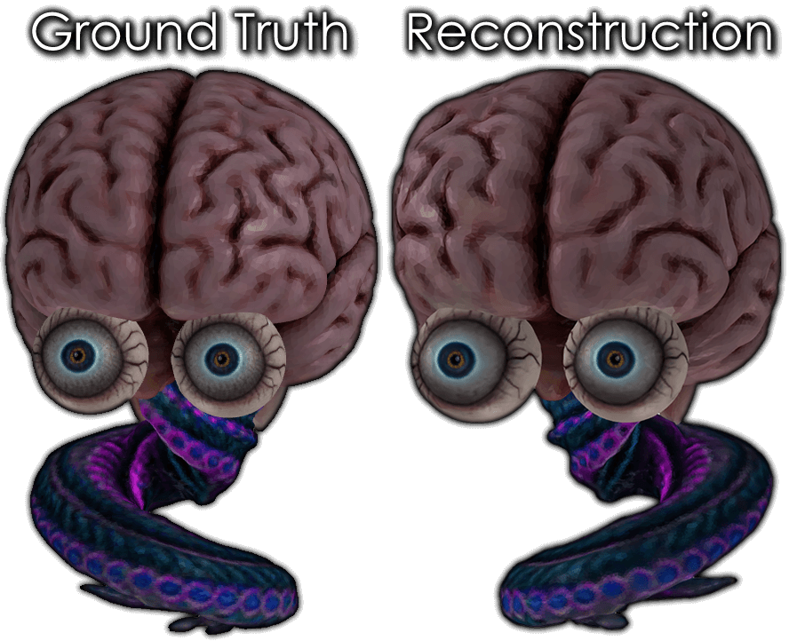

Trains a neural network to output the RGB color for a given XYZ coordinate on a 3D mesh.

This could be considered a form of lossy compression.

```
pip install tensorflow numpy pandas trimesh "pyglet<2"
python3 fit.py
```

